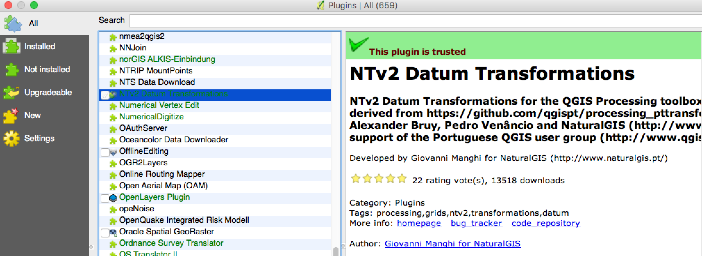
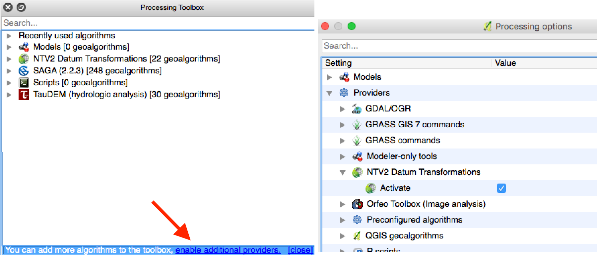
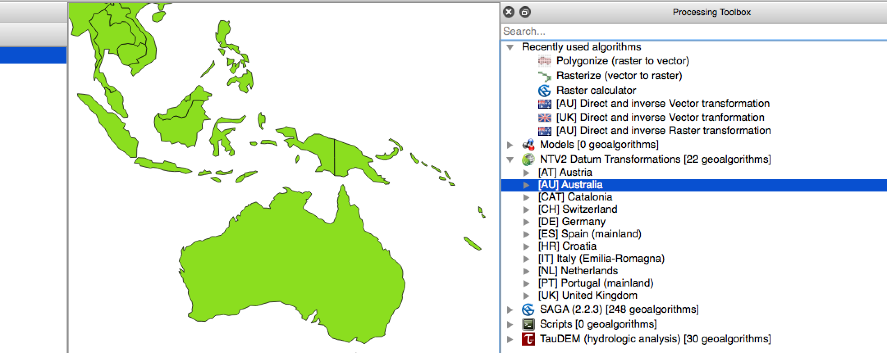
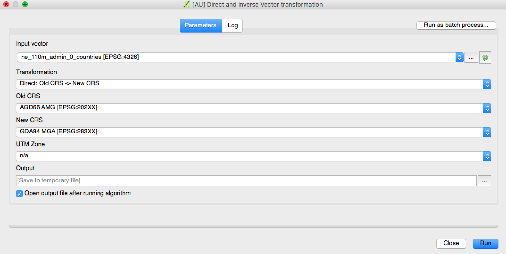

# NTv2 Datum Transformations Plugin for QGIS

## Introduction

The NTv2 Datum Transformations plugin for QGIS was created and is maintained by NaturalGIS, and the project can be found on [Github](https://github.com/NaturalGIS/ntv2_transformations).

The plugin uses Processing, and as such, it requires this to be installed and enabled. This document will cover how to install the plugin, how to find it in the processing toolbox, and how to use run the Australian transformations.

## Installing the plugin

QGIS has complete documentation on installing plugins, so have a look at [their documentation](http://docs.qgis.org/2.0/en/docs/training_manual/qgis_plugins/fetching_plugins.html). The plugin is titled "NTv2 Datum Transformations". 

To install the plugin, do the following:
 * Go to the 'Plugins' menu and click 'Manage and Install Plugins' (this will update the list of available plugins as it opens)
 * Next ensure you're on the 'All' tab and search for 'ntv2' (this should narrow the list of plugins down)
 * Check the box next to the plugin, and click the 'Install plugin' button.

## Setting up the processing toolbox

The processing toolbox is also a plugin, and it should be installed automatically when you install QGIS. If you don't have a menu item labelled 'Processing', follow the previous instructions to install the NTv2 Datum Transformations plugin, but search for 'Processing' and ensure that it is installed and enabled. (It's enabled if the box next to it is checked.)

To open the processing toolbox and enable the NTv2 Datum Transformations plugins, do the following:
 * Go to the 'Processing' menu item and click 'Toolbox' (this will be ticked if it's already open)
 * Processing has its own plugin system for process providers, so you need to enable the ntv2 plugin as a 'provider'. To do this, click on the 'enable additional providers' button
 * In this dialog, expand 'Providers', then 'NTv2 Datum Transformations' and then check the box 'Activate'

 * This will add an item to the processing toolbox labelled "NTV2 Datum Transformations. If you expand the item, you can see each transformation grouped by country.

## Running a vector or raster transformation

In order to run a vector or raster transformation, choose the appropriately labelled tool (Direct and Inverse Raster/Vector transformation). The dialog looks like this:

To run the transformation, do the following:
 * Load an input dataset (either choose one from your workspace from the dropdown, or click the '...' to load one from your computer)
 * Select the Direct or Indirect transformation (from Old to New, or New to Old)
 * Choose the 'Old' CRS and the 'New' CRS
 * If you're working with UTM (MGA or AMG) coordinates, you need to specify the Zone
 * For 'output' you can leave it blank to write to a temporary file, or choose an output file with '...'.
 * The checkbox 'Open output file after running algorithm' will load the resulting layer into your workspace.

*Important note: the first time your run the plugin it will need to download the transformation grids, as they are not included in the main plugin download in order to save space. If you need to manually download these, see the optional step below.* 

## Extras

### Support

If you're having trouble with this plugin, you can find support through the community at [GIS StackExchange](gis.stackexchange.com).

If there are bugs or problems with the plugin, you can raise an issue against the [project on GitHub](https://github.com/NaturalGIS/ntv2_transformations).

### Manually installing the transformation files

If you want to manually install the transformation files, you can do it as follows:
 * Navigate to the ICSM GitHub repository for the transformation files, and download all the '.gsb' files: https://github.com/icsm-au/transformation_grids
 * Copy these files into the following folder: ~/.qgis2/python/plugins/ntv2_transformations/grids/ *Note: This .qgis directory is in your home or User directory, depending on your platform, and may be hidden.*
